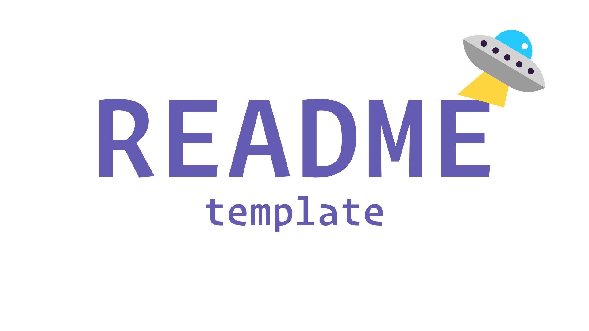

<div id="top"></div>

<!-- VARIABLES TO GLOBAL SEARCH + REPLACE
- rust-cli-starter                           // repo_name
- Rust CLI Starter                           // project_title
- A starter template for a Rust CLI program  // project_description
- MylesWritesCode                            // github_username
- MylesCodesEmoji                            // twitter_handle
- myles-berueda                              // linkedin_username
- me@themapletree.io                         // email
-->

<!-- [![Forks][forks-shield]][forks-url] -->
<!-- [![Stargazers][stars-shield]][stars-url] -->
<!-- [![Issues][issues-shield]][issues-url] -->

<!-- PROJECT LOGO -->
<br />
<div align="center">
  <a href="https://github.com/MylesWritesCode/rust-cli-starter">
    
  </a>

<h3 align="center">Rust CLI Starter</h3>

  <p align="center">
    A starter template for a Rust CLI program
    <br />
    <a href="https://github.com/MylesWritesCode/rust-cli-starter"><strong>Explore the docs »</strong></a>
    <br />
    <br />
    <a href="https://github.com/MylesWritesCode/rust-cli-starter">View Demo</a>
    ·
    <a href="https://github.com/MylesWritesCode/rust-cli-starter/issues">Report Bug</a>
    ·
    <a href="https://github.com/MylesWritesCode/rust-cli-starter/issues">Request Feature</a>
  </p>
</div>

<!-- TABLE OF CONTENTS -->
<details>
  <summary>Table of Contents</summary>
  <ol>
    <li>
      <a href="#about-the-project">About The Project</a>
      <ul>
        <li><a href="#built-with">Built With</a></li>
      </ul>
    </li>
    <li>
      <a href="#getting-started">Getting Started</a>
      <ul>
        <li><a href="#prerequisites">Prerequisites</a></li>
        <li><a href="#installation">Installation</a></li>
      </ul>
    </li>
    <li><a href="#usage">Usage</a></li>
    <li><a href="#roadmap">Roadmap</a></li>
    <li><a href="#contributing">Contributing</a></li>
    <li><a href="#license">License</a></li>
    <li><a href="#contact">Contact</a></li>
    <li><a href="#acknowledgments">Acknowledgments</a></li>
  </ol>
</details>

<!-- ABOUT THE PROJECT -->

## About The Project

[![Product Name Screen Shot][product-screenshot]](https://example.com)

This is your basic Rust CLI starter kit. Most of the README isn't going to make
sense until I figure out exactly what and how I want the project to be built. In
the meantime, feel free to use this as-is.

<p align="right">(<a href="#top">back to top</a>)</p>

### Built With

- [Clap](https://github.com/clap-rs/clap)

<p align="right">(<a href="#top">back to top</a>)</p>

<!-- GETTING STARTED -->

## Getting Started

Using this template is pretty easy - just take a look at the prerequisites and
installation steps below.

### Prerequisites

- [Rust](https://rust-lang.org)

### Installation

### Most brute-force way to use this template

> _This'll get you up and running fairly quickly_

1. Clone the repo

   ```
   # with https
   git clone https://github.com/MylesWritesCode/rust-cli-starter.git

   # or ssh
   git clone git@github.com:MylesWritesCode/rust-cli-starter.git
   ```

2. Remove the `.git` directory

   ```
   # cd into the cloned directory
   cd rust-cli-starter

   # delete `.git`
   rm -rf .git
   ```

3. Re-init git
   ```
   git init
   ```
4. Create a repo on your preferred git hosting site (e.g. GitHub)
5. Add your new remote to your local git instance
   ```
   git remote add origin <your url>
   git add .
   git commit -m 'init'
   git push origin <your branch>
   ```
6. Start hacking away

### Simpler, since you're here

> _alternatively, the "I have a Github account" way_

1. [Github docs][github-template-docs] telling you to click the button above,
   labeled "Use this template".
2. ???
3. Profit by hacking away after you clone your new repo.

[github-template-docs]: https://docs.github.com/en/repositories/creating-and-managing-repositories/creating-a-repository-from-a-template

<p align="right">(<a href="#top">back to top</a>)</p>

<!-- USAGE EXAMPLES -->

## Usage

This repo is meant to be used as a template for Rust CLI programs. Metadata 
files will be within the `.meta` folder. In there, you'll find places to put
your project logo and screenshot. Importantly, you'll find a fresh README.md 
that you can use to overwrite this one.

Happy hacking!

_For more examples, please refer to the [Documentation](https://example.com)_

<p align="right">(<a href="#top">back to top</a>)</p>

<!-- ROADMAP -->

## Roadmap

- [ ] Feature 1
- [ ] Feature 2
- [ ] Feature 3
  - [ ] Nested Feature

See the [open issues](https://github.com/MylesWritesCode/rust-cli-starter/issues) for a full list of proposed features (and known issues).

<p align="right">(<a href="#top">back to top</a>)</p>

<!-- CONTRIBUTING -->

## Contributing

[![Contributors][contributors-shield]][contributors-url]

Contributions are what make the open source community such an amazing place to learn, inspire, and create. Any contributions you make are **greatly appreciated**.

If you have a suggestion that would make this better, please fork the repo and create a pull request. You can also simply open an issue with the tag "enhancement".
Don't forget to give the project a star! Thanks again!

1. Fork the Project
2. Create your Feature Branch (`git checkout -b feature/AmazingFeature`)
3. Commit your Changes (`git commit -m 'Add some AmazingFeature'`)
4. Push to the Branch (`git push origin feature/AmazingFeature`)
5. Open a Pull Request

<p align="right">(<a href="#top">back to top</a>)</p>

<!-- LICENSE -->

## License

[![MIT License][license-shield]][license-url]

Distributed under the MIT License. See `LICENSE.txt` for more information.

<p align="right">(<a href="#top">back to top</a>)</p>

<!-- CONTACT -->

## Contact

**Myles Berueda**

[![Twitter][twitter-shield]][twitter-url]

[![LinkedIn][linkedin-shield]][linkedin-url]

<p align="right">(<a href="#top">back to top</a>)</p>

<!-- ACKNOWLEDGMENTS -->

<!-- ## Acknowledgments -->

<!-- - []() -->
<!-- - []() -->
<!-- - []() -->

<!-- <p align="right">(<a href="#top">back to top</a>)</p> -->

<!-- MARKDOWN LINKS & IMAGES -->

[contributors-shield]: https://img.shields.io/github/contributors/MylesWritesCode/rust-cli-starter.svg?style=for-the-badge
[contributors-url]: https://github.com/MylesWritesCode/rust-cli-starter/graphs/contributors
[forks-shield]: https://img.shields.io/github/forks/MylesWritesCode/rust-cli-starter.svg?style=for-the-badge
[forks-url]: https://github.com/MylesWritesCode/rust-cli-starter/network/members
[stars-shield]: https://img.shields.io/github/stars/MylesWritesCode/rust-cli-starter.svg?style=for-the-badge
[stars-url]: https://github.com/MylesWritesCode/rust-cli-starter/stargazers
[issues-shield]: https://img.shields.io/github/issues/MylesWritesCode/rust-cli-starter.svg?style=for-the-badge
[issues-url]: https://github.com/MylesWritesCode/rust-cli-starter/issues
[license-shield]: https://img.shields.io/github/license/MylesWritesCode/rust-cli-starter.svg?style=for-the-badge
[license-url]: https://github.com/MylesWritesCode/rust-cli-starter/blob/master/LICENSE
[linkedin-shield]: https://img.shields.io/badge/-LinkedIn-black.svg?style=for-the-badge&logo=linkedin&colorB=555
[linkedin-url]: https://linkedin.com/in/myles-berueda
[twitter-shield]: https://img.shields.io/twitter/follow/MylesCodesEmoji?style=for-the-badge
[twitter-url]: https://twitter.com/MylesCodesEmoji
[product-screenshot]: .meta/screenshot.png
